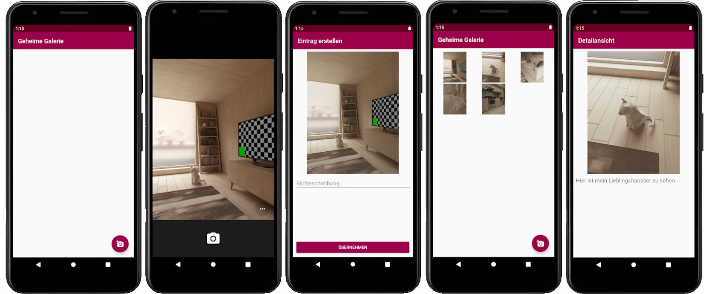

# U08 | Geheime-Bildergalerie

## Aufgabe

In dieser Aufgabe implementieren Sie eine App, die den Nutzer\*innen das anlegen einer geheimen Bildergalerie erlaubt. Die App greift auf andere Anwendungen zurück, um Bilder aufzunehmen. Diese werden nicht am zentralen Speicherort des Android-Systems abgelegt sonderen in einem separaten Ordner gespeichert und tendenziell nur innerhalb der App selber angezeigt.

### Vorgaben
Das _User Interface_ ist, inklusive der notwendigen Klassen zur Anzeige der Bild über einen _Recycler-View_, vollständig vorgegeben. Sie Implementieren in dieser Aufgabe vorrangig die Interaktion der Anwendung mit den externen Kamera-Apps und das das Speichern der Bildinformationen in einer _Room_-Datenbank. Natürlich können Sie das _Design_ aber beliebig erweitert.

## Hinweise

### Kameraaufnahmen mit dem Emulator

Die Verwendung der Kamera wird in den _AVDs_ im Normallfall durch eine virtuelle Szene emuliert. Nach dem Start der App können Sie sich mit der Maus und den Tasten `W`, `A`, `S` und  `D` durch diese Szene bewegen, um ein Motiv auszuwählen. Dazu müssen Sie unter Windows die `Shift`- (Umschalt) und auf dem Mac die `Option`-Taste gedrückt halten.

### Starterpaket

Im Starterpaket haben wir Ihnen einige Klassen vorgegeben, die Sie zur Lösung der Aufgabe verwenden bzw. erweitern müssen:


- **`GalleryActivity`**: Diese Activitiy wird beim Start der Anwendung angezeigt und beinhaltet eine _RecyclerView_, in der alle über die App aufgenommenen Bilder in einer Rasteransicht dargestellt werden. 
- **`DetailActivity`**: Diese Activity zeigt ein einzelnes Bild und den zugehörigen Beschreibungstext an. Die Activity wird durch die Auswahl eines Bildes ausd er Galerie geöffnet.
- **`CreationActivity`**: Diese Activity wird über den _Floating Action Button_ der `GalleryActivity` erreicht. Hier wird ein neues Bild über die externe App aufgenommen und mit einem Beschreibungstext versehen.
- **`SecretImage`**: Diese Klasse repräsentiert ein einzelnes Bild innerhalb der App. Beim Erstellen eines neuen Objektes wird das im Konstruktor übergebene Bitmap über eine bereits implementierte Methode im internen Speicher der App gespeichert. Statt dem Bild wird dann nur der Pfad zum Speicherort als Klassenvariable hinterlegt. Um das jeweilige Bild zu laden kann die `getBitmap()` Methode verwendet werden, die basierend auf dem Pfad das Bild wieder aus dem Speicher lädt. 
- **`SecretImageManager`**: Diese Klasse trennt das _User Interface_ von der Datenschicht der Anwendung. Der Manager verwaltet die Bilder innerhalb unserer App.

## Vorgehen

### Schritt 01: Wechsel in die Creation-Activity

Sorgen Sie dafür, dass beim Klick auf den _Floating Action Button_ die `CreationActivity` aufgerufen wird.

### Schritt 02: Die Kamera-App starten

Implementieren Sie in der `CreationActitivity` die Aufnahme eines neuen Fotos mit einer anderen auf dem Gerät installierten Kamera-App. Der Aufruf externer Apps erfolgt dabei, indem Sie einen `ActivityResultLauncher` anlegen. Dies erreichen Sie über folgenden Aufruf:
```
ActivityResultLauncher launcher(new ActivityResultContracts.startActivityForResult(), new ActivityResultCallback<ActivityResult>() {
    @Override
    public void onActivityResult(ActivityResult result) {
        //Hier können Sie das result verarbeiten
    }
});
```
Um von einer anderen Activity ein Result zu erhalten starten Sie diese mit dem ActivityResultLauncher mit dem Code `launcher.launch(Intent intent)`.
Die Erstellung des Intent-Objekts variiert hier jedoch je nach Anwendungsfall. Für die Erzeugung des Intents zum Aufruf der Kamera können Sie sich an den Codebeispielen der Vorlesung oder des weiter unten verlinkten Guides orientieren. Im verlinkten Guide finden Sie außerdem eine Anleitung, wie Sie einen `FileProvider` im Manifest registrieren.

### Schritt 03: Das aufgenommene Bild verarbeiten

Ob die Aufnahme erfolgreich abgeschlossen ist, können Sie aus dem `result` des implementierten ActivityResultLaunchers mit `result.getResultCode()` auslesen. Versuchen Sie hier auch eine sinnvolle Lösung für den Fall zu implementieren, dass die Nutzer\*innen die Kamera-App schließen, ohne ein Bild aufgenommen zu haben. 
Wurde das Bild erfolgreich aufgenommen, so soll es in der `ImageView` der Activity angezeigt werden und von den Nutzer\*innen mit einer Beschreibung versehen werden. Beim Klick auf den Speicher-Button soll basierend aus den erhobenen Daten ein Objekt der Klasse `SecretImage` erstellt und an die `GalleryActivity` zurückgegeben werden, um es dann dort anzeigen zu lassen.

Eine gute Anlaufstelle zur Einbindung der Kamera ist [in diesem Guide](https://developer.android.com/training/camera/photobasics#TaskCaptureIntent) zu finden. 
Eine ausführlichere Erklärung zum ActivityResultLauncher gibt es [in diesem Guide](https://developer.android.com/training/basics/intents/result). Beachten Sie hier, dass der für uns relevante ActivityResultContract `ActivityResultContracts.StartActivityForResult()` ist.

### Schritt 04: Bilder in der RecyclerView anzeigen

Stellen Sie sicher, dass die aufgerufenen `CreationActivity` das neue Bild als Ergebnis zurückgibt und verarbeiten Sie dieses in der `GalleryActivity`. Die neu erstellten Bilder übergeben Sie dort dem `SecretImageManager` übergeben. Durch die bereits vorhandene Implementierung wird dabei auch automatisch der Adapter des `RecyclerView` informiert. Damit die (neuen) Bilder aber auch im _User Inteface_ angezeigt werden, müssen Sie den verwendeten _View Holder_ (`SecretImageViewHolder`) vervollständigen. In dessen `bindViews()` Methode soll das Bild im vorbereiteten *ImageView* angezeigt werden. Außerdem besteht hier die Möglichkeit, einzelne Views mit einem Klick-Listener zu versehen (siehe nächster Punkt). 

### Schritt 05:  Bilddetails anzeigen

Klicks auf einzelne Bilder der Galerie sollen dafür sorgen, dass die `DetailActivity` aufgerufen wird. Hier wird das ausgewählte Bild dann angezeigt. Damit das Bild dort dargestellt werden kann, muss dem jeweiligen Intent das angeklickt `SecretImage`-Objekt übergeben werden. 

### Schritt 06: Bilder dauerhaft speichern

Damit unsere _SecretImages_ dauerhaft erhalten bleiben, sollen Sie in einer Room-Datenbank gespeichert werden. Annotieren Sie also die entsprechend zu speichernde Entität und Erstellen sie das _DataAccessObject_, die Datenbank und eine passende _Helper_-Klasse. Binden Sie anschließend die Datenbank an den entsprechenden Stellen an die restliche App an. Denken Sie daran, Ihre Datenbankoperationen **nicht auf dem UI-Thread** laufen zu lassen, sondern diese alle in eigene Threads auslagern.

Sie können sich hierbei am Lösungsvorschlag der Datenbank-Implementierung der [5. Übungsaufgabe](https://android-regensburg.github.io/AssignmentViewer/index.html#Android-Regensburg/U05-Persistente-ToDo-Liste) orientieren. 


## Screenshots der Anwendung


